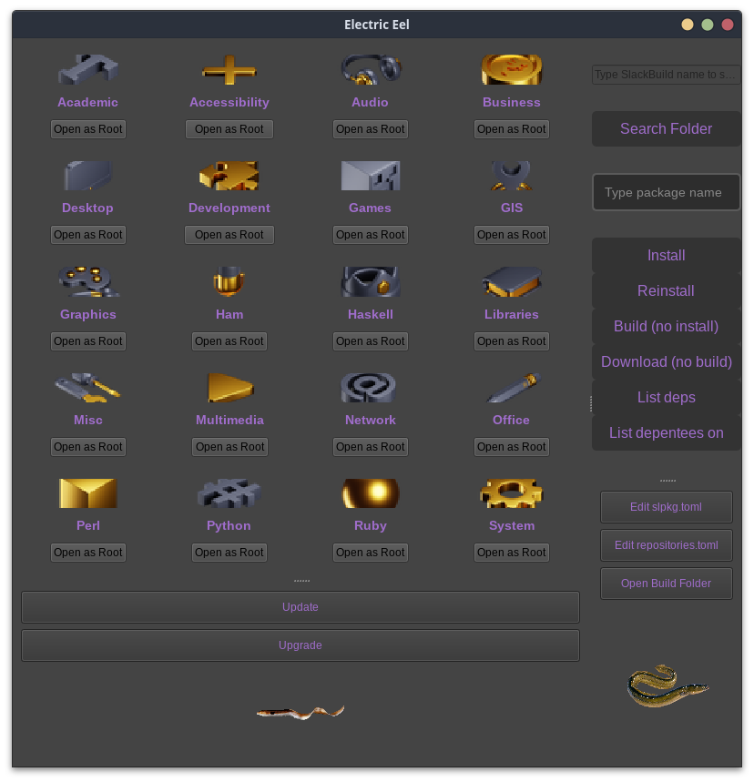

# Electric eel
*Electric eel is a PyQt5  [slpkg](https://dslackw.gitlab.io/slpkg) plugin. We can name it as slpkg-gui...but thats not true.*<br>
*Reason for using eeel is beacuse make it easy to `edit/build/patch/install...` SlackBuilds from [SlackBuilds.org](https://github.com/SlackBuildsOrg/slackbuilds.git) or [ponce](https://github.com/Ponce/slackbuilds) repositories in case that needed.*<br>
I wrote eeel for personal use, because I m slpkg and  Slackware-current fan and current`s SlackBuilds need a small hack  for  often ...



### Install
You can find a SlackBuild [here]()

### Setup
By default app is ready and foccuss for Slackware-stable and [SlackBuilds.org](https://github.com/SlackBuildsOrg/slackbuilds.git).<br>
If you are in Slackware-current and your *slpkg* `repositories.toml` has [ponce](https://github.com/Ponce/slackbuilds) = true , then:
<br>open with your text editor `/etc/eeel/eeel.env` and un-comment `# SLAKCBUILDS_REPO=ponce`.<br>
It should be like this `SLAKCBUILDS_REPO=ponce`. <br>
Thats all.


### HowTo
As you know [Electric eels](https://en.wikipedia.org/wiki/Electric_eel) are known for their ability to stun their prey by generating electricity, delivering shocks at up to 860 volts.<br>
That means you ran in Slackware a gui package manager in full root mode...<br>

### Thank very very much for icons:
[pngwing.com](https://www.pngwing.com/)<br>
[hiclipart.com](https://www.hiclipart.com/)<br>
[thenounproject.com](https://thenounproject.com/)<br>
[iconfinder.com](https://www.iconfinder.com/)<br>

### And Thanks Dimitris
[](https://gitlab.com/dslackw/slpkg)


### Also many thanks
To all people maintain SlackBuilds and Slackbuilds.org.<br>

```
_____ __           __
/ ___// /___ ______/ /___      ______ _________
\__ \/ / __ `/ ___/ //_/ | /| / / __ `/ ___/ _ \
___/ / / /_/ / /__/ ,<  | |/ |/ / /_/ / /  /  __/
/____/_/\__,_/\___/_/|_| |__/|__/\__,_/_/   \___/

```
<p>
Slackware™ is a [trademark](http://www.slackware.com/trademark/trademark.php) of Patrick Volkerding.
</p>

```
                            __              _______
  ___  _________ __      __/ /___________ _/ / ___/
 / _ \/ ___/ __ `/ | /| / / //_/ ___/ __ `/ /\__ \ 
/  __/ /  / /_/ /| |/ |/ / ,< / /__/ /_/ / /___/ / 
\___/_/   \__,_/ |__/|__/_/|_|\___/\__,_/_//____/  
                                                   

```
